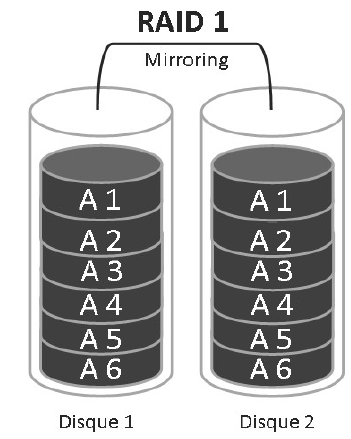

# RAID 1

## 🔧 **Caractéristiques**

- 🪞 Aussi appelé **Mirroring** (effet miroir)
- 🧱 Se compose de **2 disques durs**
- ✍️ Les **données sont répliquées** sur les deux disques : chaque écriture est **copiée simultanément**
- 🔁 Objectif : **continuité d'accès aux données** même en cas de panne d'un des disques

## 📉 **Performances**

- 📥 **Lecture/Écriture modérées** à cause de la duplication
- ⚖️ Légère perte de performance compensée par **une forte fiabilité**

## 🛠️ **Gestion des pannes**

- 🧩 Si un disque tombe en panne, les données sont **intégralement disponibles** sur l'autre
- 🔄 Le disque défectueux peut être **remplacé sans perte** de données ni interruption de service

## ✅ **Avantages**

- 🔒 **Excellente tolérance aux pannes**
- 💡 **Accès ininterrompu** aux données en cas de défaillance
- 🔧 Facile à mettre en œuvre pour des systèmes critiques

## 📌 **Résumé**

Le RAID 1 offre une **protection simple et fiable** des données grâce à la duplication. Idéal pour les systèmes où **la sécurité des données** est plus importante que la performance brute.

