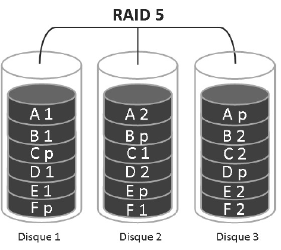

# RAID 5🔧

## **Caractéristiques générales (Également appelé Système distribué avec parité)**

- ➕ Nécessite **au minimum 3 disques durs**
- 🔄 Les données et la **parité** (informations de redondance) sont **réparties en cascade** sur tous les disques
- 🚀 **Bonnes performances en lecture**, mais 📉 **écriture modérée**

## 🛠️ **Fonctionnement & Tolérance à la panne**

- 🧠 **Parité répartie** : chaque disque contient à tour de rôle un bloc de parité
- 💥 En cas de **panne d’un disque**, le système peut **reconstruire les données manquantes** à l’aide des blocs de parité et des autres disques
- 🔄 Ex : reconstruction(Données Disque1 + Disque3 + Parité)
- 🕒 La reconstruction peut prendre jusqu’à **24h**, mais **les données restent accessibles** pendant ce temps (mode dégradé)

## ⚠️ **Impact sur les performances en mode dégradé**

- 📉 **Lecture** : passe de bonne à **très modérée** voire **mauvaise**
- 🖊️ **Écriture** : **fortement dégradée**, surtout pendant la reconstruction

## ✅ **Avantages**

- 🔐 Bonne **tolérance à la panne** d’un disque
- 📊 **Équilibre entre performance, capacité et sécurité**
- 💾 Pas de perte de capacité excessive grâce à la **répartition de la parité**

## 📌 **Résumé**

Le RAID 5 offre une **solution fiable et équilibrée** pour les environnements nécessitant de la **redondance sans sacrifier trop d’espace**. Il est très utilisé en entreprise pour **sécuriser les données tout en maintenant un bon niveau de performance**.

