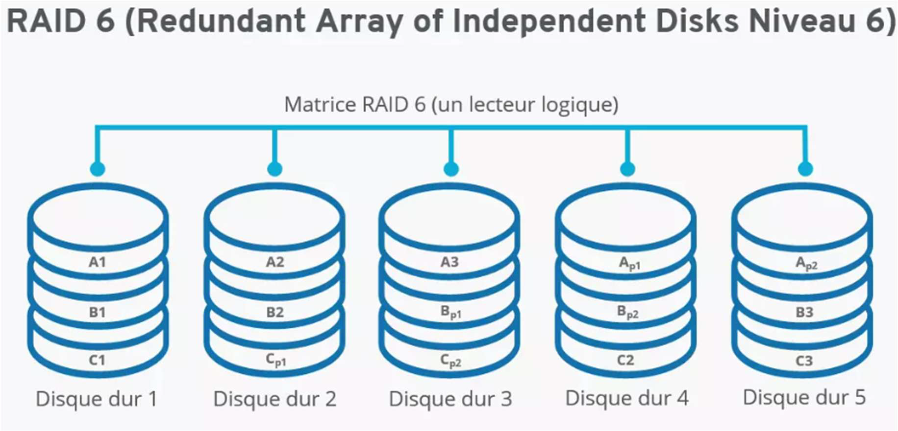

# RAID 6

## 🛡️ **Définition**

RAID 6 est une technologie de stockage en **grappe de disques** qui offre une **double parité**, permettant la **tolérance de panne de deux disques durs simultanés** sans perte de données.

📌 Il fonctionne de manière similaire au RAID 5, **mais stocke deux blocs de parité** au lieu d’un seul, répartis sur l’ensemble des disques.

## ⚙️ **Caractéristiques principales**

- 🔁 **Double parité** ➜ meilleure tolérance aux pannes
- 💥 **Peut supporter la défaillance de 2 disques** sans perte de données
- 🧮 **Écriture plus lente** que le RAID 5, à cause du **double calcul de parité**
- ✅ **Lecture rapide**, surtout pour les grands volumes de données
- 🔒 Idéal pour les **systèmes critiques** (serveurs, NAS professionnels, stockage long terme)

## 🧠 **Exemples d’usage**

- 🌐 Systèmes NAS pour entreprise
- 🏥 Infrastructures médicales
- 💼 Services financiers
- 📊 Stockage de bases de données volumineuses

## 📉 **Avantages**

- 🔁 Haute redondance (2 disques de tolérance)
- 🔐 Haute sécurité des données
- 📈 Bonne performance en lecture

## 📈 **Inconvénients**

- 🐢 Écriture plus lente (calcul double de parité)
- 💸 Coût plus élevé (au moins **4 disques minimum**)
- 📊 Capacité utile réduite (plus de disques dédiés à la parité)

