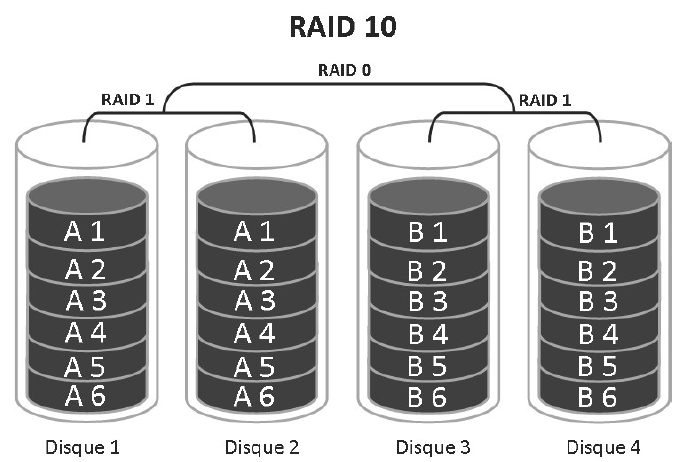

# RAID 10

## 🔧 **Caractéristiques générales**

- 🔄 Aussi appelé **RAID 1+0**
- 🔢 Nécessite **minimum 4 disques durs**
- 🔗 Combine les avantages du **RAID 1 (mirroring)** et du **RAID 0 (stripping)**
- 📂 **Organisation** : des grappes **RAID 1** (réplication) sont **liées sous un RAID 0**.

## ⚙️ **Fonctionnement**

- 🪞 Chaque paire de disques forme un **RAID 1** ➜ tolérance à la panne d’**1 disque par paire**
- ⚡ Les différentes paires sont ensuite agrégées en **RAID 0** ➜ performance accrue
- 📉 Espace utile = **50 % de l’espace total**, car chaque disque est dupliqué

## 🚀 **Performances et avantages**

- ✅ **Très bonnes performances** en **lecture et écriture**
- 🛡️ **Tolérance aux pannes** : perte d’un disque par sous-grappe RAID 1 sans perte de données
- 🔁 Reconstitution rapide et accès continu en cas de défaillance
- 🧠 Idéal pour les **applications critiques** : bases de données, serveurs à haute disponibilité

## 📌 **Résumé**

Le RAID 10 combine la **sécurité du RAID 1** et la **vitesse du RAID 0**.

Il garantit à la fois **résilience et performance**, au prix d’un espace disque réduit, et représente une **solution haut de gamme pour les environnements exigeants**.

