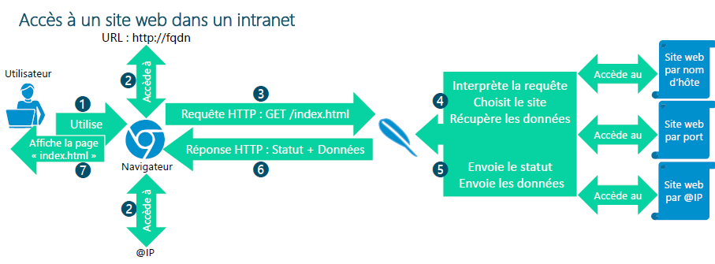

# Fonctionnement serveur WEB🖥️ **🔎 Qu’est-ce qu’un serveur Web ?**

Un **serveur Web** est une machine connectée à un réseau (intranet ou Internet), capable de :

- 🌐 **Héberger du contenu web** : pages HTML, fichiers CSS, JS…
- 📡 **Répondre à des requêtes HTTP/HTTPS** : envoyées depuis un navigateur
- 🔧 **Servir des sites web** selon l’adresse IP, le port, ou le nom d’hôte (FQDN)

💡 Serveurs Web les plus répandus :

- 🐘 **Apache**
- 🚀 **NGINX (EngineX)**
- 🪟 **IIS (Internet Information Services)**

📥 **🧰 Accès à un site web – Étapes du fonctionnement**

1.  👤 **L’utilisateur** ouvre un navigateur
2.  🌍 Il entre une URL (ex : <http://mon-site.local>)
3.  🔎 Le navigateur contacte un **serveur DNS** pour résoudre le **FQDN → adresse IP**
4.  🖥️ Le navigateur envoie une **requête HTTP** vers cette IP (avec ou sans port spécifique)
5.  🌐 Le **serveur Web** reçoit et **interprète la requête**
6.  📂 Il **sélectionne le site** correspondant à l'IP, au port ou au nom d’hôte
7.  📄 Il **récupère les données** demandées (ex : index.html)
8.  📬 Il envoie une **réponse HTTP** contenant un **code de statut** (200, 404…) et les **données**
9.  🧾 Le navigateur **affiche la page** à l'utilisateur

🧭 **📊 Accès par différentes méthodes**

Un site peut être atteint de plusieurs façons :

- 🧠 **Par adresse IP** directe ( <http://192.168.1.10>)
- 🚪 **Par port spécifique** ( <http://mon-site.local:8080>)
- 🏷️ **Par nom d’hôte** ( <http://intranet.entreprise.local>)

