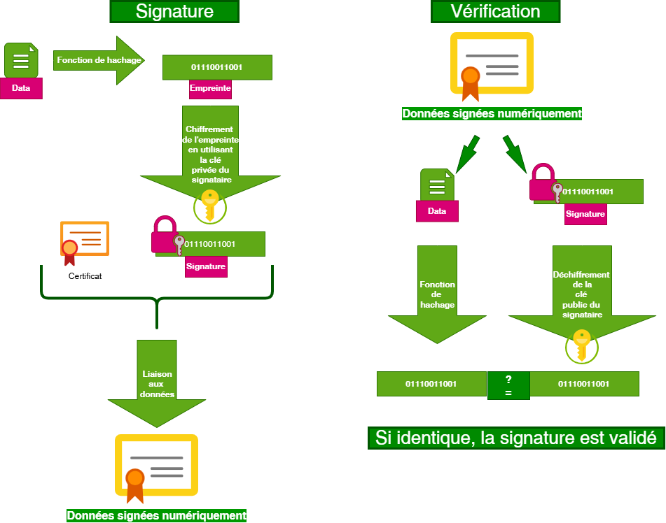

# Processus de Hashage

Le **hachage** est un **processus unidirectionnel** qui transforme des données de taille variable en une empreinte (hash) de taille fixe, unique à ces données. Il est utilisé pour vérifier l'intégrité des données et dans les signatures numériques.

Note : Le terme "hachage" est préféré au terme "hashage", anglicisme peu usité en français technique. L'empreinte produite est appelée "hash" en anglais.

## Étapes du processus de hachage

## Erratum/Corrections : 
- "Chiffrement de l'empreinte" → "Signature de l'empreinte"
- "Déchiffrement de la clé public" → "Vérification de la signature avec la clé publique"