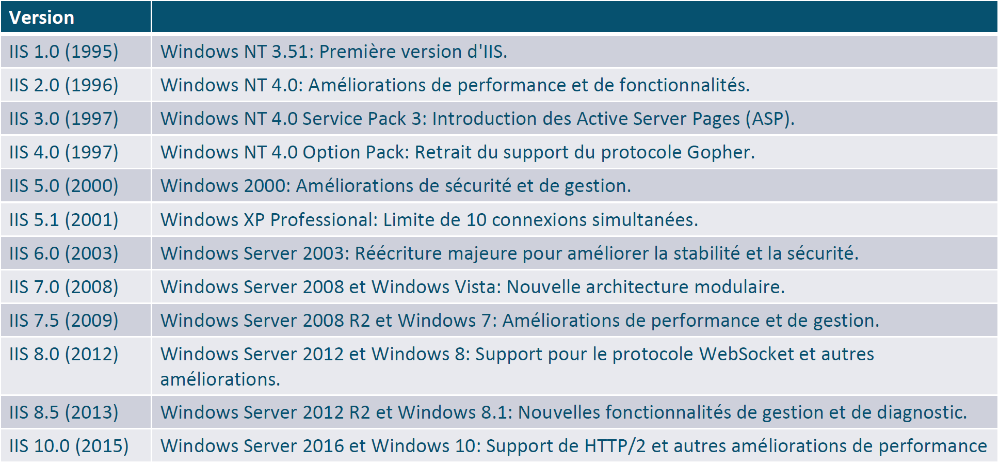

# Présentation**IIS** est l’acronyme de **Internet Information Services**.

C’est le serveur web développé par **Microsoft**, intégré aux systèmes d’exploitation **Windows Server** et certaines versions de **Windows Desktop**.

**⚙️ Installation d’IIS**

🧩 IIS s’installe à partir du **Gestionnaire de serveur** dans Windows Server.

🔧 Une fois activé, il devient possible de gérer des **sites web** via le **Gestionnaire IIS (GUI)**.

**🧪 Vérification de l’installation**

🔍 L’installation peut être vérifiée en ouvrant un **navigateur web** sur la machine où IIS est installé :

- <http://@IP>
- <http://127.0.0.1>
- <http://localhost>  
  Une page de bienvenue IIS doit s’afficher si le serveur web est actif.

**📁 Répertoires d’installation**

📂 Répertoire principal : C:\inetpub\

📂 Répertoire du **site web par défaut** : C:\inetpub\wwwroot\

**💻 Accès via PowerShell**

IIS peut être administré en ligne de commande avec

PowerShell, pour :

- Installer des rôles
- Ajouter des sites
- Gérer les liaisons
- Automatiser des tâches d’administration web

