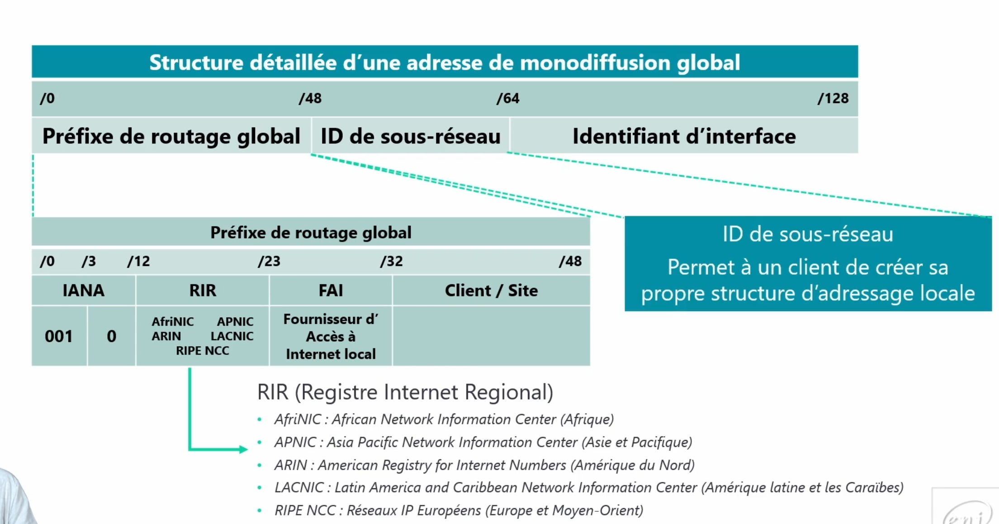

# Global UnicastLes **Global Unicast Addresses (GUA)** sont les **équivalents des adresses IPv4 publiques** en IPv6. Elles permettent **la communication directe entre appareils sur Internet**, à condition que les règles de routage et de pare-feu l’autorisent.

📌 **Structure d’une Adresse GUA (128bits)**  
✅ **Préfixe Global (48 bits)**

- Identifie un réseau spécifique à l’échelle mondiale.
- Attribué par les **RIR** (*Regional Internet Registries*), comme **RIPE** ou **ARIN**.

✅ **Sous-réseau (16 bits)**

- Permet de **diviser le réseau global** en sous-réseaux internes.
- Utilisé par les entreprises et organisations pour structurer leur réseau.

✅ **Identifiant d’Interface (64 bits)**

- Identifie **une interface unique** sur le réseau.
- Généralement dérivé de l’**adresse MAC** via le format **EUI-64** ou défini manuellement.

**📡 Pourquoi Utiliser les GUA ?**

✅ **Adressage unique et mondialement routable**.

✅ **Plus besoin de NAT**, chaque appareil peut être directement joignable.

✅ **Sécurité et contrôle avec des pare-feux et politiques de routage**.

✅ **Meilleure organisation des réseaux grâce aux sous-réseaux**.

