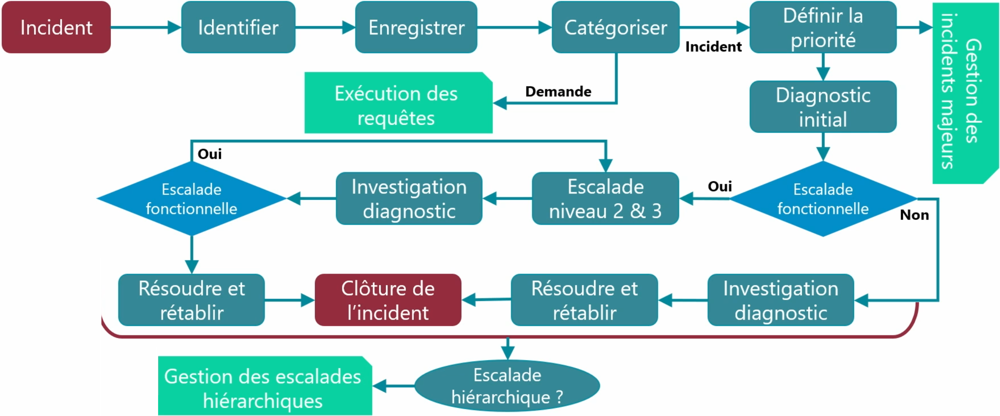

# Gestion des incidentsL’objectif principal de la **gestion des incidents** est de **rétablir le service le plus rapidement possible** tout en **respectant les engagements contractuels** (SLA).

Le but **n’est pas de trouver la cause racine** du problème (ça, c’est le rôle de la **gestion des problèmes**, traitée par des techniciens de niveau 2 ou 3).

**🛠️ Comment le technicien agit ?**

Il s'appuie sur : **Ses connaissances personnelles et La base de connaissances** de l’entreprise, qui contient des incidents déjà rencontrés et leurs solutions associées

L’idée : **minimiser l’impact sur les utilisateurs**, **prioriser** les incidents, et **respecter les délais de résolution**.

**🆘 Définir un incident, un événement et un problème**

- **Événement** : un fait détecté sur l’infrastructure (ex : alerte de supervision). Il ne gêne pas forcément le service.
- **Incident** : quand un événement **impacte la qualité d’un service**.
- **Problème** : un **incident récurrent**, qui affecte plusieurs utilisateurs ou systèmes.

**⚖️ La gestion des priorités : Impact + Urgence**

On attribue une **priorité** à chaque incident en croisant : **L’impact** : nombre d’utilisateurs touchés, gravité des pertes, non-conformité réglementaire, etc. et **L’urgence** : temps disponible pour rétablir le service

📊 On utilise une **matrice de priorité** (Impact x Urgence) pour déterminer : Le **niveau de priorité** (de 1 à 5) et Le **délai de rétablissement attendu** (ex : 1h pour priorité 1, "best effort" pour priorité 5)

**💥 Les incidents majeurs**

Ce sont les incidents qui : Touchent un grand nombre d’utilisateurs et Ont un impact critique sur l’activité

Ils déclenchent des **procédures d’urgence** (plans de reprise ou de continuité d’activité), mobilisent **plusieurs techniciens en parallèle**, et **suspendent temporairement la gestion des incidents moins prioritaires**.

**📈 Les deux types d’escalade d’incident**

- **Fonctionnelle** : le technicien n’a pas les compétences nécessaires ➜ il transfère à une autre équipe spécialisée (niveau 2 ou 3). et
- **Hiérarchique** : le technicien **n’a pas le temps** de résoudre l’incident dans le délai imparti ➜ il transmet à un niveau supérieur pour respecter les SLA.

**📅 Les calendriers**

Ils définissent : Les **jours et horaires d’ouverture du client et** Les **jours et horaires du centre de services (support)**

👉 Ces infos permettent de **calculer les délais maximum de rétablissement**.

**📚 Base de connaissances & outils d’aide**

- **Base de connaissances** : recense les incidents connus et leurs résolutions
- **Checklists / procédures / modèles d’incident** : facilitent le diagnostic rapide

En cas de crise, **tous les autres incidents peuvent être mis en pause** pour concentrer les ressources sur la résolution du problème critique.

**🧭 Le cycle de vie d’un incident (schéma simplifié)**

