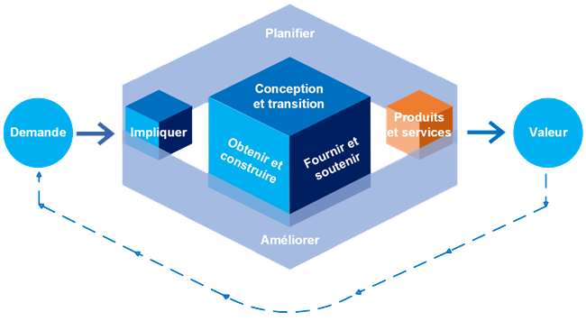

# Chaine de valeur du ServiceLa **CVS**, c’est **le composant central** du **Service Value System (SVS)**. Elle est composée de **6 activités principales** qui peuvent s’**enchaîner dans tous les sens** selon les besoins (et pas en ligne droite !). C’est un modèle **flexible**, dynamique, adapté à la complexité des services modernes.

🔧 Les 6 activités de la Chaîne de Valeur

Voici les **6 blocs** de la chaîne de valeur, qu'on va voir **dans l’ordre logique**, mais **ils peuvent interagir dans n’importe quel sens**.

**Planifier (Plan)** Objectif : définir la **vision**, la **stratégie**, les **politiques**, la **planification à long terme**.

🔹 On pose les bases : quelles sont les priorités, les objectifs, les ressources ? 🔹 S’aligne avec la **gouvernance** et les **principes directeurs**.

**Améliorer (Improve)** Objectif : **améliorer en continu** les services, pratiques, composants de la chaîne.

🔹 Cette activité est **transversale** à toute la chaîne : à chaque étape, on peut l’activer pour optimiser. 🔹 On applique ici les principes du **cycle PDCA** (Plan – Do – Check – Act).

**Engager (Engage)** Objectif : créer une **relation forte avec les parties prenantes** (utilisateurs, clients, partenaires, fournisseurs).

🔹 On écoute les **besoins**, on **comprend la demande**, on **recueille les retours**. 🔹 On gère la communication, la satisfaction et les attentes.

**Concevoir et faire évoluer (Design & Transition)** Objectif : **concevoir** les nouveaux services ou **modifier** les existants.

🔹 On s’assure qu’ils sont **prêts à être livrés** dans de bonnes conditions. On parle ici d’**architecture**, de **test**, de **documentation**, de **formation**, etc.

**Obtenir/Construire (Obtain/Build)** Objectif : **acquérir, développer, assembler** les composants nécessaires au service.

🔹 Ça peut être du **logiciel**, du **matériel**, des **ressources humaines**, etc. 🔹 On prépare les éléments techniques du futur service.

**Fournir et soutenir (Deliver & Support)** Objectif : **livrer le service** aux utilisateurs et en assurer le **support** au quotidien.

🔹 On est dans la **production**, l’exploitation du service. 🔹 Support, helpdesk, supervision, gestion des incidents, etc.

**⚙️ Exemple concret : création d’un service ITSM**

**📌 Demande :** Fournir une **solution ITSM** à la DSI : Gestion de parc / Suivi des incidents / Gestion des demandes / Base de connaissances / Suivi des contrats prestataires

**🔁 Comment les activités s’enchaînent ?**

1.  **Engage** → Recueillir les besoins des utilisateurs et des responsables de la DSI.
2.  **Plan** → Définir les priorités : quels modules déployer en premier ? Quelle solution choisir ?
3.  **Design & Transition** → Concevoir l’architecture de la solution, tester des outils (GLPI, ServiceNow, etc.), préparer le déploiement.
4.  **Obtain/Build** → Installer les serveurs, paramétrer la solution ITSM, rédiger les modes d’emploi, former les équipes.
5.  **Deliver & Support** → Mettre en production, assurer le support utilisateurs, recueillir les incidents et demandes.
6.  **Improve** → Après 1 mois : on analyse les retours → on améliore l’ergonomie, on ajoute des modules, etc.

