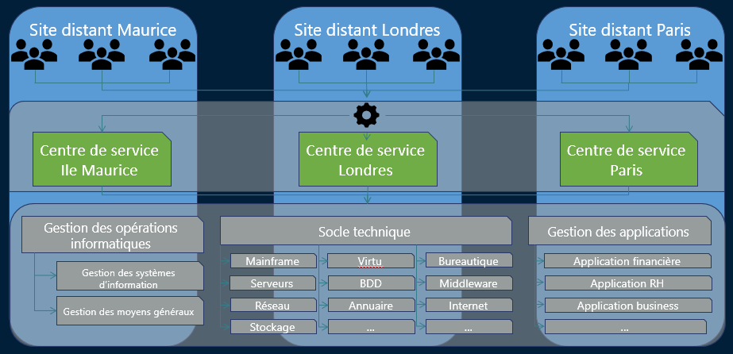

# Virtualisé**📖 Définition :**

Le **centre de services virtuel** est **décentralisé géographiquement**, mais **fonctionne comme une seule entité logique**. Il met automatiquement **le bon technicien en relation avec le bon demandeur**, selon plusieurs critères.

**🎯 Objectif principal :**

Mettre l’utilisateur en relation avec **le technicien le plus pertinent**, en fonction de :

| 🕒 Heure | Appel dirigé vers un site ouvert |
|--|--|
| 🌍 Pays ou site d’appel | Respect des contraintes linguistiques, légales, techniques |
| 🧑 Profil de l’utilisateur | VIP, utilisateur sensible, technicien interne, etc. |
| 💼 Métier du demandeur | RH, Finance, Business → pour matcher avec un technicien spécialisé |
|  |  |

**✅ Avantages :** Meilleure réactivité | Acheminement intelligent = gain de temps | Crédibilité renforcée | Les utilisateurs tombent sur **un technicien compétent et adapté** | Optimisation mondiale | Idéal pour les entreprises **internationales**

**❌ Inconvénients :** Complexité technique | Systèmes téléphoniques (SVI) à mettre en place | Coordination difficile | Plusieurs sites → plusieurs équipes

**🧯 Comment limiter les inconvénients ?**

| 🧑‍💼 **Responsable unique** | Coordination centralisée, homogénéité des services |
|--|--|
| 🧰 **Outils avancés** | Acheminement intelligent + suivi centralisé des tickets |

