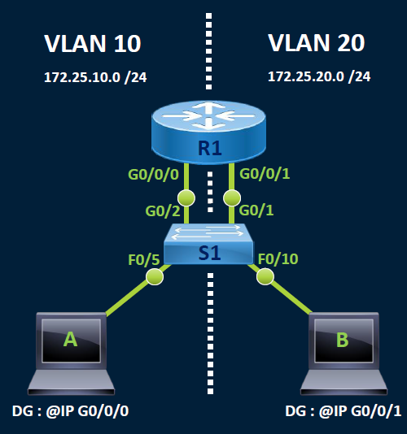
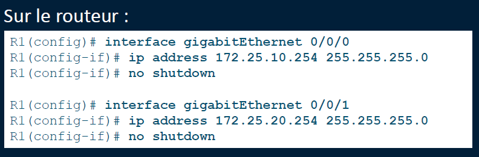
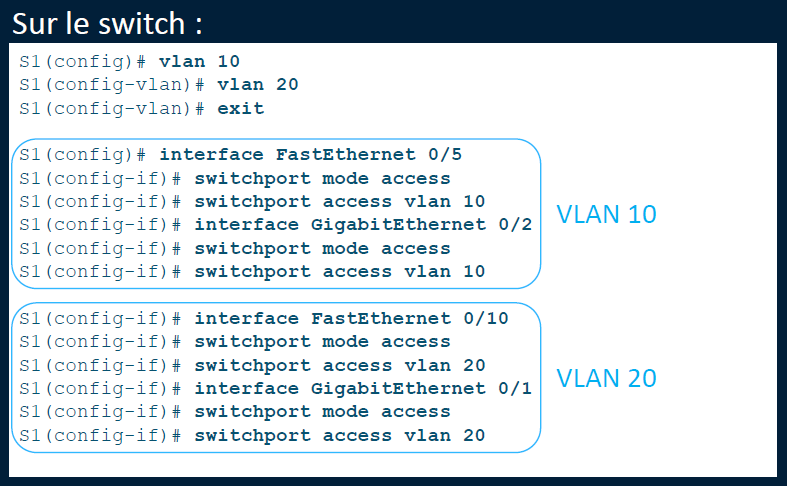

# Traditionnel**🧯 Méthode 1 : Routage traditionnel (routeur avec 2 interfaces physiques)**

🧱 **Principe** : une interface physique par VLAN (ex: Fa0/0 pour VLAN 10, Fa0/1 pour VLAN 20)

🔌 **Sur le routeur** :

- Associer chaque interface à un réseau IP distinct
- Activer les interfaces (no shutdown)

🔀 **Sur le switch** :

- Créer les VLAN (ex : 10, 20)
- Affecter les ports des machines aux bons VLANs
- Brancher chaque VLAN vers une interface dédiée du routeur

⚠️ ➤ *Méthode peu scalable : il faut autant d'interfaces physiques que de VLANs !*

