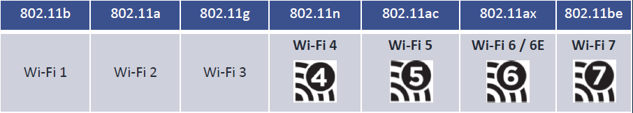

# Fonctionnement/Normes19:14

**📡 Introduction au Wi-Fi**

Les réseaux Wi-Fi sont omniprésents dans **tous les secteurs** : entreprise, domicile, lieux publics...

Ils répondent à un **besoin fort de mobilité**. Le standard de référence est la **norme IEEE 802.11**

(plusieurs versions selon les débits, fréquences, portée...).

**🧪 Wi-Fi Alliance & certification**

La **Wi-Fi Alliance** est un organisme qui teste et certifie les équip. sans fil selon normes IEEE 802.11.

📍 Si l’équipement affiche le logo **Wi-Fi CERTIFIED**,

cela signifie qu’il est **interopérable** avec d’autres appareils compatibles.

**🧰 Composants matériels d’un réseau Wi-Fi**

Un bon réseau Wi-Fi s’appuie sur plusieurs équipements :

- Terminal avec carte Wi-Fi
- Point d'accès Wi-Fi (AP)
- Contrôleur d’APs (WLC)
- Routeur sans fil (souvent tout-en-un en usage domestique)

**🔁 Modes de fonctionnement : Ad hoc vs Infrastructure**

🌀 **Mode Ad hoc (IBSS)** :

Connexion directe entre terminaux, sans point d’accès (cas typique : tethering mobile).

🏢 **Mode Infrastructure** :

Connexion via un **point d’accès ou routeur** → donne l’accès au réseau local et à Internet.

**🔐 Association Wi-Fi (processus de connexion)**

Connexion d’un client Wi-Fi en 3 étapes : **1- Découverte, 2- Authentification, 3- Association**

✅ Nécessite des paramètres communs : SSID, Clé ou mot de passe, Norme 802.11 supportée, Type de sécurité (WPA2, WPA3…), Canal radio utilisé

**⚠️ Gestion des collisions : CSMA/CA**

Le Wi-Fi est en **half duplex**, donc une seule transmission à la fois.

📡 Pour éviter les collisions :

- Utilisation du **CSMA/CA** (Carrier Sense Multiple Access / Collision Avoidance)
- Procédure :
  - **RTS** (Ready To Send) → envoyé par le terminal
  - **CTS** (Clear To Send) → réponse du point d’accès

Ce mécanisme assure que personne ne parle en même temps, **réduit les collisions** mais **introduit une latence**.

