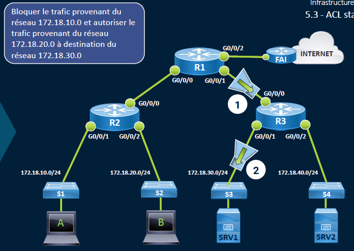

# ACL Standard**🚦 ACL Standard : Objectif et Rôle**

Les **ACL standard** (Access Control Lists) permettent un **filtrage simple du trafic IP** 🎯

Elles agissent uniquement **sur l’adresse IP source** du paquet.

🔹 Objectifs :

• 🔒 Filtrer le trafic entre réseaux (ex : bloquer LAN10 vers LAN30)

• 🎛️ Appliquer du **Source-NAPT**

• 🛡️ Contrôler l’accès admin au routeur

• 🏷️ Classer le trafic pour la QoS

📌 2 plages de numéros valides : 1 à 99 et 1300 à 1999

⚠️ À placer **au plus proche de la destination**

(car pas de filtre sur IP de destination ni protocole)

**🛠️ Création d’une ACL standard**

🧾 Deux types : **Numérotée** :

access-list <num> remark <commentaire>

access-list <num> deny|permit <source IP> <wildcard>

**Nommée** :

ip access-list standard <nom>

deny|permit <source IP> <wildcard>

Exemple clair : • 🚫 Interdire LAN10 → LAN30 • ✅ Autoriser LAN20 → LAN30

**🎯 Application d’une ACL à une interface**

Pour l’activer, on l’attache à l’interface : interface <interface>

- ip access-group <num|nom> [in|out] (ici, **out** car filtrage en sortie)

**🔍 Vérif de l’ACL**

📊 Commandes utiles :

- show access-lists → voir les règles + compteurs de matches
- show ip interface <iface> → voir les ACL appliquées (in/out)
- clear access-list counters → reset des compteurs

📌 **Chaque ACL a une fin implicite en "deny all"** → Si aucun permit, tout est bloqué ❌

**🧮 Gestion des numéros de séquence**

Chaque règle a un **numéro de séquence** (10, 20, 30…) : Tu peux les modifier individuellement :  
→ no <num> puis num <nouvelle règle> Tu peux **insérer entre deux lignes** : → ajouter 15 entre 10 et 20

✂️ Supprimer une ACL : no ip access-group <num> sur l'interface / no access-list <num> pour la virer du routeur

