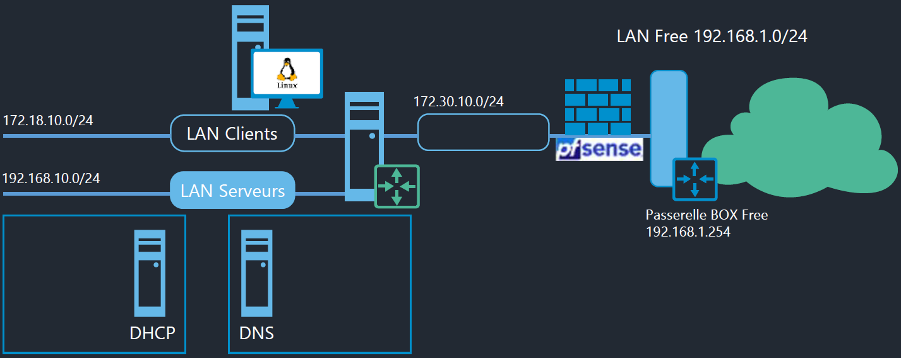

# Bac à Sable**🧰 Objectif du bac à sable**

Un **environnement virtuel** est mis en place pour les TP. Il permet de **tester et configurer plusieurs services réseau** dans un cadre sécurisé.

- 🎯 Cible : **pfSense** (pare-feu/routeur) + **Debian 10** (serveurs)
- 🧪 Objectif : créer un **laboratoire réseau** proche d'une vraie infra

**🧱 Structure de l’environnement**

- 🖥️ **Machines virtuelles** : plusieurs VMs Debian + 1 VM pfSense
- 🔄 **Plusieurs services par VM** selon les besoins
- 🛠️ **Virtualisation** via **VMware Workstation**
- 🔌 **Réseaux isolés** via des **VMNet** distincts (LAN Clients, LAN Serveurs…)

**🔧 Conseils de config**

- 🧭 Oriente-toi dans le schéma de droite vers la gauche : FAI → pfSense → LANs
- 🔐 pfSense joue le rôle de **pare-feu et routeur** entre WAN et LANs
- 🧪 Utilise les **VMNet isolés** pour simuler des sous-réseaux propres (LAN client, LAN serveur, DMZ…)

**🛰️ Réseaux logiques utilisés**

Réseaux de la maquette simulée :

- 🧍‍♂️ **LAN Clients** : 172.18.10.0/24
- 🧑‍💻 **LAN Serveurs** : 172.30.10.0/24
- 🌐 **WAN vers FAI** : 192.168.1.0/24
- 🎯 **Passerelle FAI** : 192.168.1.254
- 📦 **DHCP, DNS, etc.** : 192.168.10.x

