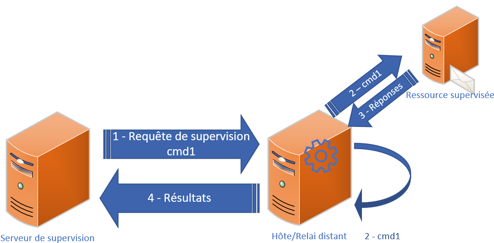
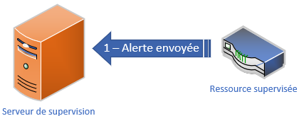

# Moyens de supervision**🧩 Principes clés de la supervision**

🎯 Objectifs essentiels :

- 🛑 **Non-intrusivité** : ne pas alourdir ou perturber les machines supervisées
- 🔌 **Indépendance** : la supervision ne doit pas dépendre du bon fonctionnement de l'élément surveillé

**📡 Supervision active**

La méthode **la plus utilisée** : envoie des requêtes depuis le superviseur vers les machines. On parle de **checks actifs**.

**✅ Checks actifs locaux**

- 🔍 Exécutés **directement depuis le serveur de supervision**
- Permettent de surveiller : CPU, RAM, disque du superviseur, ou test réseau (ex : socket TCP/UDP)
- Avantage : pas besoin d’agent distant

Exemple : *tcptest localhost 80*

**🌐 Checks actifs distants**

- 📤 Commande lancée par le superviseur, **exécutée sur la machine distante**
- ⚙️ Nécessite un **agent sur la machine distante** + commandes de check présentes
- Utilise : check_by_ssh, check_nrpe, requêtes **SNMP** ou **WMI**
- ✅ Avantages : soulage le superviseur, donne accès à des infos locales ou externes

Exemple : *ssh user@remote-server 'curl -I [http://example.com'](http://example.com)*

**📥 Supervision passive**

Dans ce mode, c’est **l’élément supervisé** qui envoie spontanément les infos ou alertes au superviseur, sans requête en amont.

- ⚡ Mode **temps réel** : dès qu’un événement se produit (ex : port switch HS), il est remonté
- ❗⚠️ Limite : **pas d’alerte ≠ bon état**
- Souvent combinée avec de l’active pour fiabiliser
- Idéal pour les logs, erreurs système, alertes réseau

**📨 Protocoles de supervision passive**

- 📡 **SNMP Trap** : envoi d’alertes depuis des équipements réseau (config définie par le constructeur)
- 📤 **NSCA (Nagios Service Check Acceptor)** : envoie d'infos vers le superviseur depuis Linux ou Windows. Flexible et multi-plateforme.

