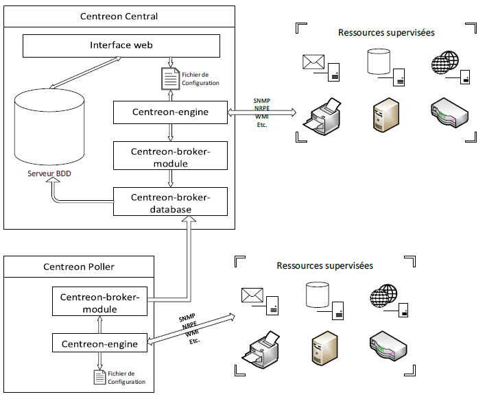

# Rôles et architecture**🧠 Centreon Central Database : le noyau dur**

Le **Centreon Central Database** est le serveur principal, il concentre tous les rôles critiques de la supervision :

- **Centreon Engine** (moteur de supervision)
- **Centreon Web** (interface de gestion)
- **Centreon Broker Module** + **Broker Database** (collecte + enregistrement)
- **Base de données** par défaut : *MariaDB* (peut être *PostgreSQL* selon les cas)

💡 **Astuce** : la base peut être **déportée** sur une autre machine pour répartir la charge ou augmenter la sécurité.

**📡 Les Pollers : les agents de terrain**

Les **Centreon Pollers** sont des nœuds déployés sur les sites à superviser. Ils n’embarquent que :

- **Centreon Engine**
- **Centreon Broker Module**

Leur rôle : effectuer les vérifications localement puis **remonter les résultats** au serveur central.

🧩 La communication se fait via **SSH** (ou **ZMQ**), avec un échange de **clés RSA** indispensable pour l’authentification entre poller et Central.

**🗺️ Résumé des rôles dans l'archi distribuée**

Voici les composants principaux et leurs rôles :

- **Centreon Central** : moteur + interface + brokers + base de données
- **Pollers** : moteur + broker module (pas d’interface, pas de base)
- **Base de données** : MariaDB ou PostgreSQL, centralisée ou séparée
- **Communication** : SSH (ou ZMQ), nécessite échange de clés

