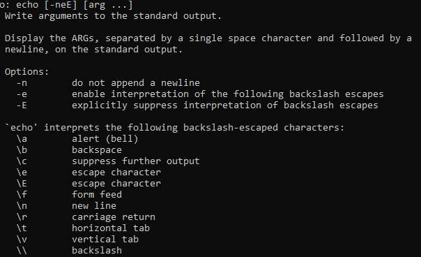

# 3 - Premières commandes**🧠 Intro – Nature des commandes internes**
- 🛠️ Les commandes comme echo, clear, exit, help sont **internes à Bash**
- ❌ Aucun fichier binaire (type /bin/ls) n’est associé
- 📌 Elles sont **intégrées dans le shell**, donc toujours dispo sans dépendance externe

**📣 echo – Afficher du texte dans le terminal**

- 🔹 **Syntaxe** : echo [options] "expression"
- 🪄 Options utiles (avec -e activé) :
  - \n → saut de ligne
  - \t → tabulation
  - \ → affiche un \
  - \c → supprime le retour à la ligne final (reste sur la même ligne)
- ✅ Met les chaînes contenant des caractères spéciaux entre **guillemets doubles** ("...")
- 🔁 Utilisé **massivement** dans les scripts pour afficher infos, erreurs, menus...

**🧼 clear – Nettoyer l'écran**

- 🧯 Commande **simple et sans argument**
- 💡 Vide l'écran pour avoir un affichage propre
- 📌 Très pratique pour **rendre un script plus lisible** ou faire des interfaces en ligne de commande plus "clean"

**🚪 exit – Quitter le script**

- 🔹 **Syntaxe** : exit [n]
  - n = **code retour** envoyé au Shell père (souvent 0 pour succès)
- 🧬 Par défaut, le exit est **implicite en fin de script**, mais le préciser est une **bonne pratique**
- 🔁 Le code de sortie peut être récupéré via $? après l’exécution du script

**📚 help – Obtenir de l’aide sur les commandes internes**

- 🔹 help → liste **toutes les commandes internes de Bash**
- 🔹 help nom_commande → affiche l’aide sur une commande spécifique
  - Ex : help exit, help wait
- 📌 Très utile pour réviser rapidement sans quitter le terminal

