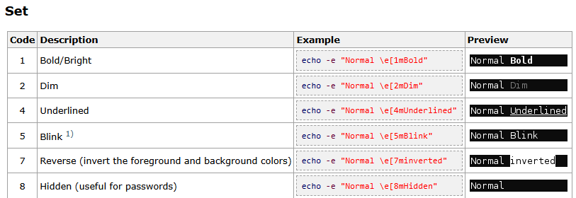
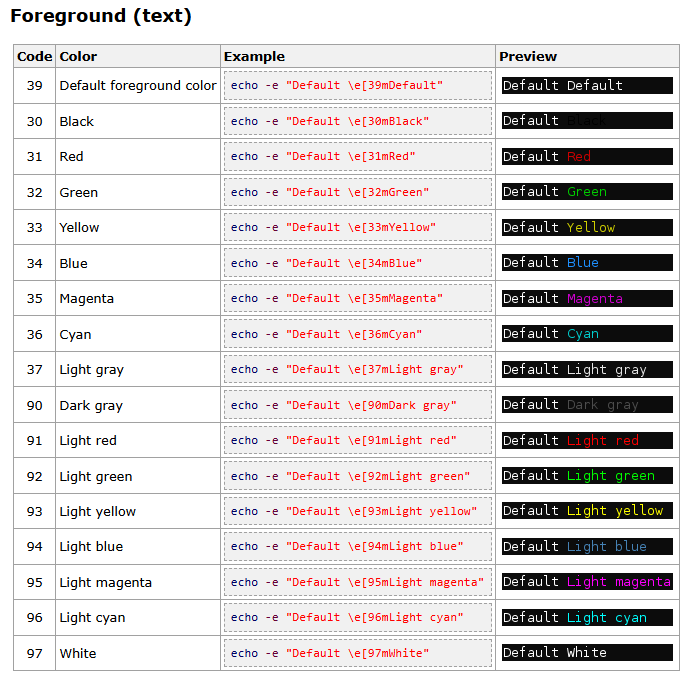

# 5 - Caractères spéciaux**➖ Enchaînement inconditionnel (;)**

Utilisé pour exécuter plusieurs commandes, **quoi qu’il arrive** (succès ou échec).

🧠 *Exemple* : mkdir /data ; touch /data/file1 ; cat /home/bonjour.txt

👉 Peu importe si mkdir échoue, touch et cat seront quand même lancées. Utilisé en ligne de commande ou dans les scripts pour chaîner des actions.

**✅ Enchaînement conditionnel && (logique "ET")**

N'exécute la commande suivante **que si la précédente réussit** (code retour 0).

🧠 *Exemple* : mkdir ./data && touch ./data/file1

👉 touch sera exécuté *seulement* si mkdir réussit. Très utile pour éviter des erreurs en cascade, logique "si ok, alors".

**❌ Enchaînement conditionnel || (logique "OU")**

N'exécute la commande suivante **que si la précédente échoue** (code retour ≠ 0).

🧠 *Exemple* : mkdir ./data 2>/dev/null || echo "Erreur de création du répertoire" 👉 Très pratique pour afficher un message d’erreur personnalisé en cas d'erreur.

**🧠 Retour de commande : le $?**

Chaque commande retourne un **code de sortie** : 0 = succès ✅ ≠0 = échec ❌. Ce code est stocké dans la variable spéciale $?, utilisée implicitement par && et ||.

**🌀 Regroupement de commandes avec sous-shell ()**

( cmd1 ; cmd2 ; ...) → Exécuté dans un **environnement enfant**, donc les changements ne persistent pas dans le shell principal (ex : changement de dossier, variables).

🧠 *Exemple* : (cd /tmp ; ls) → après exécution, tu restes dans ton répertoire d'origine.

➡️ Aussi utilisé pour **rediriger plusieurs commandes** dans un seul | ou >. Ex : (ls /bin ; ls /usr/bin) | wc -l

**🔒 Regroupement de commandes sans sous-shell {}**

{ cmd1 ; cmd2 ; ... ; } → Exécuté **dans le shell courant**, donc les effets persistent (cd, export, etc.)

⚠️ **Syntaxe stricte** : chaque commande doit être terminée par ; (même la dernière) / espaces obligatoires autour des { et }

🧠 *Exemple* : { cd /tmp ; ls ; } → Tu restes dans /tmp après l'exécution.

**🎨 Utiliser les couleurs dans le shell**

- Texte : 30 à 37 (noir à gris clair)
- Fond : 40 à 47
- Attributs : 1 = gras, 4 = souligné, 7 = inversé

🧠 *Exemple* : echo -e "voici du \033[1;32mvert\033[0m"

➡️ On commence toujours par : \033[ ou \e[

➡️ On termine par : m

➡️ On réinitialise à la fin : \033[0m

