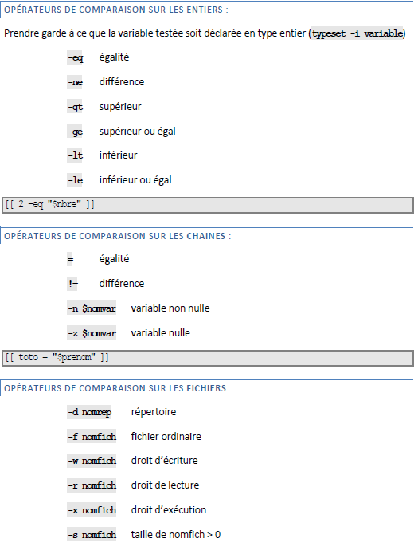

# Les conditions11:38

**🧪 Commandes de test disponibles**

- test ou [ ] ➜ test **classique**, compatible tous shells
- [[ ]] ➜ **interne à Bash**, **plus riche** (opérateurs logiques, métacaractères)
- (( )) ➜ test **arithmétique uniquement** (entiers)

**🔢 Tests sur les entiers**

Utilisables avec [[ $var -op valeur ]] ➜ typeset -i var recommandé si modif. -eq égal • -ne différent • -gt > • -ge ≥ • -lt < • -le ≤

**🔤 Tests sur les chaînes**

- = égal • != différent • -n non vide • -z vide 💡 *Ex.* [[ $prenom = sofia ]], [[ -z $prenom ]]

**🗂️ Tests sur le système de fichiers**

- -d répertoire • -f fichier classique • -r lecture • -w écriture • -x exécution • -s taille > 0

**🧩 Combinaison de conditions**

- && ET logique
- || OU logique
- ! négation
- ( ) regroupement

💡 *Ex.* [[ -f fic1 && ( -d rep1 || -d rep2 ) ]]

**🎭 Caractères spéciaux dans les chaînes**

Utilisables dans [[ "chaine" == motif ]] : 💡 Bash interprète ces motifs **comme des "glob patterns"**.

- * : 0 à n caractères
- ? : 1 caractère
- [abc] : un caractère parmi
- [^abc] : un caractère autre que

**🚀 Facteurs d’occurrence (avec extglob)**

Active avec shopt -s extglob. Permet des motifs étendus :

- ?(motif) : 0 ou 1 fois
- *(motif) : 0 à n fois
- +(motif) : 1 à n fois
- @(motif) : exactement 1 fois
- !(motif) : tout sauf ce motif

